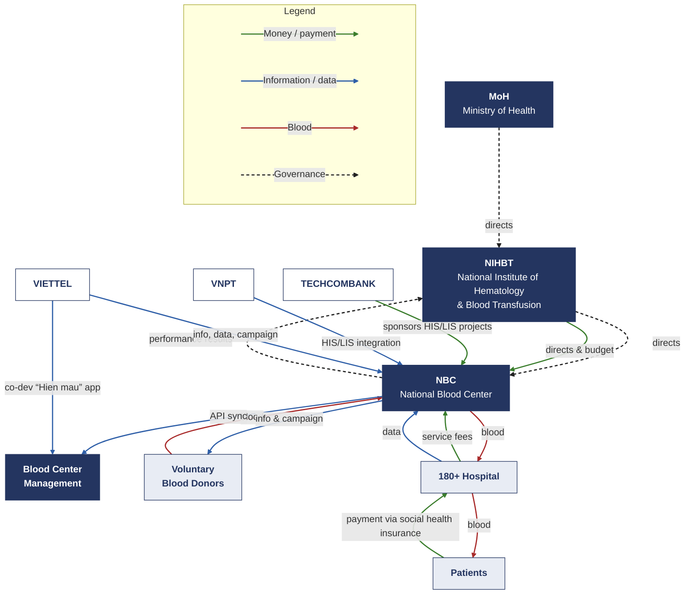

# Blood Center Ecosystem

```mermaid
flowchart TB
    MoH["<b>MoH</b><br/>Ministry of Health"]
    NIHBT["<b>NIHBT</b><br/>National Institute of Hematology<br/>& Blood Transfusion"]
    NBC["<b>NBC</b><br/>National Blood Center"]
    BCM["<b>Blood Center<br/>Management</b>"]
    TCB["<b>TECHCOMBANK</b>"]
    VBD["<b>Voluntary<br/>Blood Donors</b>"]
    HOS["<b>180+ Hospital</b>"]
    VNPT["<b>VNPT</b>"]
    VT["<b>VIETTEL</b>"]
    PAT["<b>Patients</b>"]

    %% Governance
    MoH -.->|directs| NIHBT
    NIHBT -.->|directs| NBC
    NBC -.->|performance results| NIHBT

    %% Money
    NIHBT -->|directs & budget| NBC
    TCB -->|sponsors HIS/LIS projects| NBC
    HOS -->|service fees| NBC
    PAT -->|payment via social health insurance| HOS

    %% Blood
    VBD -->|blood| NBC
    NBC -->|blood| HOS
    HOS -->|blood| PAT

    %% Information / data
    NBC -->|info & campaign| VBD
    NBC -->|API sync| BCM
    HOS -->|data| NBC
    VNPT -->|HIS/LIS integration| NBC
    VT -->|info, data, campaign| NBC
    VT -->|co-dev “Hien mau” app| BCM

    %% Legend
    subgraph Legend
        direction LR
        L1a[" "] -->|Money / payment| L1b[" "]
        L2a[" "] -->|Information / data| L2b[" "]
        L3a[" "] -->|Blood| L3b[" "]
        L4a[" "] -.->|Governance| L4b[" "]
    end

    %% Node styles
    classDef gov fill:#243560,stroke:#243560,color:#ffffff;
    classDef stake fill:#e8ecf4,stroke:#243560,color:#243560;
    classDef partner fill:#ffffff,stroke:#243560,color:#243560;
    classDef dot fill:none,stroke:none,color:none;

    class MoH,NIHBT,NBC,BCM gov;
    class VBD,HOS,PAT stake;
    class TCB,VNPT,VT partner;
    class L1a,L1b,L2a,L2b,L3a,L3b,L4a,L4b dot;

    %% Edge styles (by order of definition)
    %% 0-2 governance
    linkStyle 0,1,2 stroke:#222222,stroke-width:2px,stroke-dasharray:5 4;
    %% 3-6 money
    linkStyle 3,4,5,6 stroke:#3a7d2c,stroke-width:2px;
    %% 7-9 blood
    linkStyle 7,8,9 stroke:#a82a2a,stroke-width:2px;
    %% 10-15 information
    linkStyle 10,11,12,13,14,15 stroke:#2f5fa8,stroke-width:2px;
    %% legend
    linkStyle 16 stroke:#3a7d2c,stroke-width:2px;
    linkStyle 17 stroke:#2f5fa8,stroke-width:2px;
    linkStyle 18 stroke:#a82a2a,stroke-width:2px;
    linkStyle 19 stroke:#222222,stroke-width:2px,stroke-dasharray:5 4;
```
