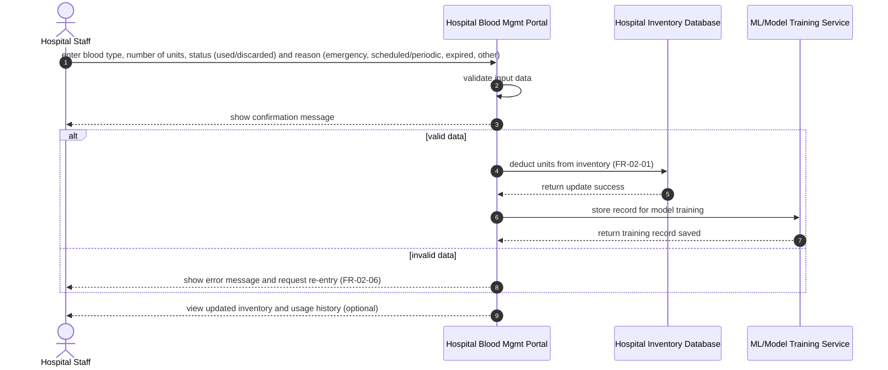

# Sequence Diagram: SD-UC-04 Record blood usage

| Field | Value |
|---|---|
| Use case | UC-04 Record blood usage |
| Version | v1 |
| FRs | FR-02-01, FR-02-06 |

```mermaid
sequenceDiagram
  autonumber
  actor S as Hospital Staff
  participant P as Hospital Blood Mgmt Portal
  participant D as Hospital Inventory Database
  participant M as ML/Model Training Service
  S->>P: enter blood type, number of units, status (used/discarded) and reason (emergency, scheduled/periodic, expired, other)
  P->>P: validate input data
  P-->>S: show confirmation message
  alt valid data
    P->>D: deduct units from inventory (FR-02-01)
    D-->>P: return update success
    P->>M: store record for model training
    M-->>P: return training record saved
  else invalid data
    P-->>S: show error message and request re-entry (FR-02-06)
  end
  P-->>S: view updated inventory and usage history (optional)
```
