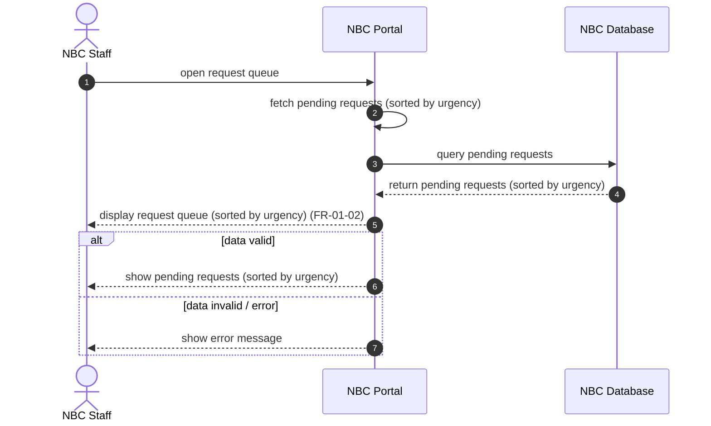

# Sequence Diagram: SD-UC-07 View request queue

| Field | Value |
|---|---|
| Use case | UC-07 View request queue |
| Version | v1 |
| FRs | FR-01-02 |

```mermaid
sequenceDiagram
  autonumber
  actor S as NBC Staff
  participant P as NBC Portal
  participant D as NBC Database
  S->>P: open request queue
  P->>P: fetch pending requests (sorted by urgency)
  P->>D: query pending requests
  D-->>P: return pending requests (sorted by urgency)
  P-->>S: display request queue (sorted by urgency) (FR-01-02)
  alt data valid
    P-->>S: show pending requests (sorted by urgency)
  else data invalid / error
    P-->>S: show error message
  end
```
