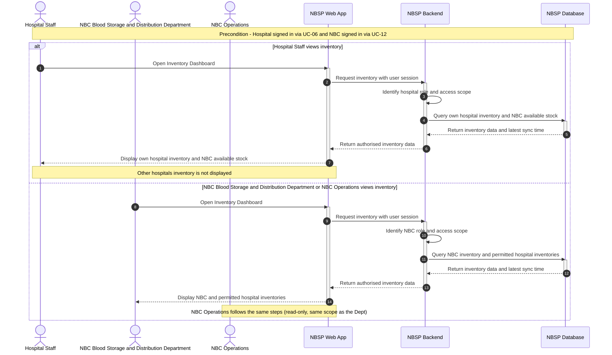

# Sequence Diagram: SD-UC-09 View inventory

| Field | Value |
|---|---|
| Use case | UC-09 View inventory |
| Version | v2 |
| FRs | FR-02-02 |

```mermaid
sequenceDiagram
  autonumber
  actor H as Hospital Staff
  actor N as NBC Blood Storage and Distribution Department
  actor O as NBC Operations
  participant D as NBSP Web App
  participant S as NBSP Backend
  participant DB as NBSP Database
  Note over H,DB: Precondition - Hospital signed in via UC-06 and NBC signed in via UC-12
  alt Hospital Staff views inventory
    H->>D: Open Inventory Dashboard
    activate D
    D->>S: Request inventory with user session
    activate S
    S->>S: Identify hospital role and access scope
    S->>DB: Query own hospital inventory and NBC available stock
    activate DB
    DB-->>S: Return inventory data and latest sync time
    deactivate DB
    S-->>D: Return authorised inventory data
    deactivate S
    D-->>H: Display own hospital inventory and NBC available stock
    deactivate D
    Note over H,D: Other hospitals inventory is not displayed
  else NBC Blood Storage and Distribution Department or NBC Operations views inventory
    N->>D: Open Inventory Dashboard
    activate D
    D->>S: Request inventory with user session
    activate S
    S->>S: Identify NBC role and access scope
    S->>DB: Query NBC inventory and permitted hospital inventories
    activate DB
    DB-->>S: Return inventory data and latest sync time
    deactivate DB
    S-->>D: Return authorised inventory data
    deactivate S
    D-->>N: Display NBC and permitted hospital inventories
    deactivate D
    Note over O,D: NBC Operations follows the same steps (read-only, same scope as the Dept)
  end
```

