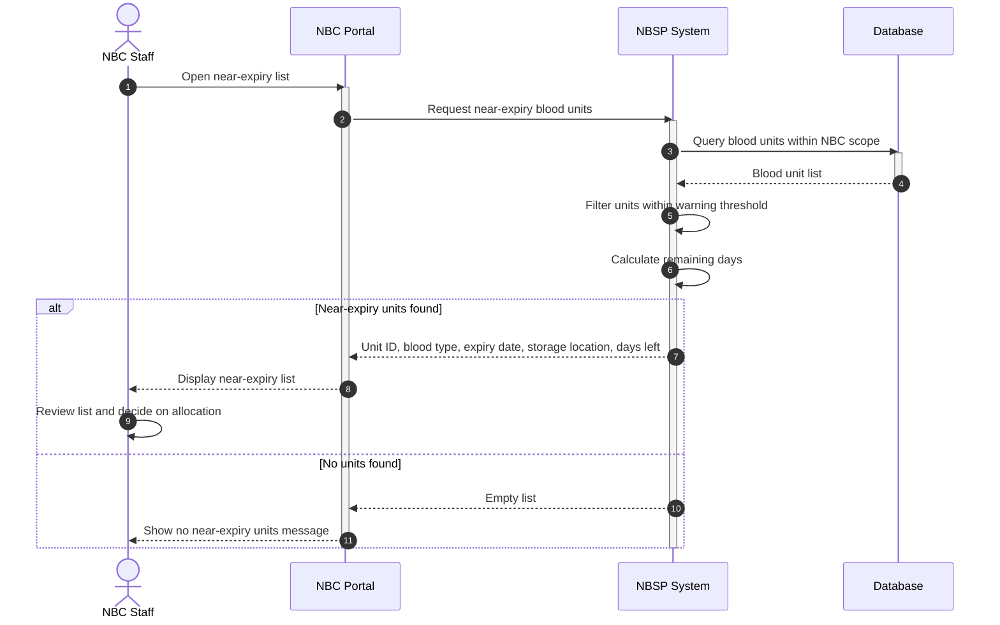

# Sequence Diagram: SD-UC-10 View near-expiry blood units

| Field | Value |
|---|---|
| Use case | UC-XX View near-expiry blood units |
| Version | v1 |
| FRs | FR-02-02, FR-02-03 |

```mermaid
sequenceDiagram
  autonumber
  actor N as NBC Staff
  participant P as NBC Portal
  participant S as NBSP System
  participant DB as Database
  N->>P: Open near-expiry list
  activate P
  P->>S: Request near-expiry blood units
  activate S
  S->>DB: Query blood units within NBC scope
  activate DB
  DB-->>S: Blood unit list
  deactivate DB
  S->>S: Filter units within warning threshold
  S->>S: Calculate remaining days
  alt Near-expiry units found
    S-->>P: Unit ID, blood type, expiry date, storage location, days left
    P-->>N: Display near-expiry list
    N->>N: Review list and decide on allocation
  else No units found
    S-->>P: Empty list
    P-->>N: Show no near-expiry units message
  end
  deactivate S
  deactivate P
```
